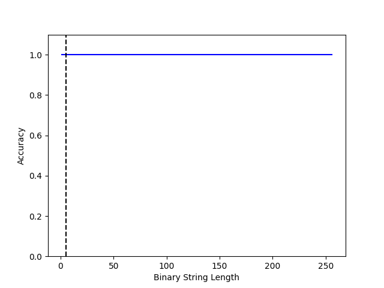
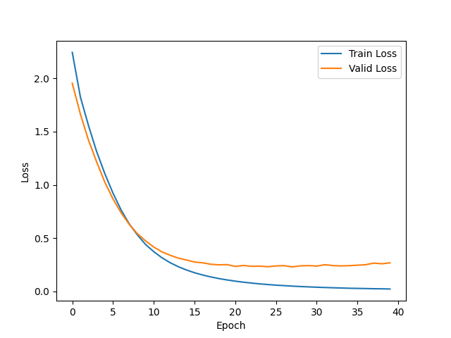

# Finite-State Machines and RNNs

This coursework project studies how recurrent networks represent finite-state behavior. It contains three independent pieces:

1. **A hand-configured scalar LSTM for parity.** Gate weights are set by hand and checked exhaustively on every length-14 bit string.
2. **A trained PyTorch LSTM for parity.** The model trains on short strings and is evaluated on much longer ones.
3. **A bidirectional LSTM part-of-speech (POS) tagger** trained on TorchText's English UDPOS dataset.

A reviewed write-up, which also covers an embedded Reber grammar experiment whose code is not in this repository, is available at [kapshaul.github.io/studies/finite-state-machine](https://kapshaul.github.io/studies/finite-state-machine/).

## Files

| File | Role |
| --- | --- |
| [`univariate_tester.py`](univariate_tester.py) | NumPy only. Scalar LSTM with hand-set gate weights, checked on all 2¹⁴ = 16,384 binary strings of length 14. No training and no downloads. |
| [`driver_parity.py`](driver_parity.py) | PyTorch. Trains `ParityLSTM` on every binary string of length 1–5, evaluates random strings of length 1–256, and saves an accuracy-versus-length PNG. |
| [`driver_udpos.py`](driver_udpos.py) | PyTorch + TorchText. BiLSTM POS tagger. `MODE = 'Train'` (default) or `'Test'`. |
| [`test_udpos.py`](test_udpos.py) | UDPOS data inspection: prints one tagged training sentence and shows a POS tag histogram. It is not a test suite and does not load the checkpoint. |
| [`Vocabulary.pkl`](Vocabulary.pkl) | Pickled `Vocabulary` instance from a past POS training run. |
| [`bilstm_pos_model.pth`](bilstm_pos_model.pth) | `BILSTM_POS` `state_dict` from a past POS training run. |
| [`Figures/`](Figures/) | Historical plots: `LSTM-{1,2,4,…,256}_parity_generalization.png` (9 files), `Loss.png`, and `Histogram.png`. |

## Environment

The scripts import `numpy`, `torch`, `torchtext`, `matplotlib`, `tqdm`, and `nltk`. The repository has no `requirements.txt`, and the versions used originally were not recorded.

- `univariate_tester.py` needs only NumPy.
- `driver_parity.py` needs `torch`, `numpy`, `matplotlib` (Agg backend, so no display is needed), and `tqdm`.
- `driver_udpos.py` uses `match`/`case`, which requires **Python 3.10+**. It calls the functional `torchtext.datasets.UDPOS(split=...)` API.
- `test_udpos.py` also imports `torch.utils.data.backward_compatibility`.
- The UDPOS scripts therefore need a torch/torchtext pair that supports Python 3.10 and still provides these APIs. No known-good combination is recorded here. torchtext itself is no longer developed.
- `driver_udpos.py` `Test` mode tokenizes example sentences with `nltk.word_tokenize`, which needs the NLTK Punkt data (`punkt`, or `punkt_tab` on recent NLTK). The script does not download it.

## Running

Run each script from the repository root. The scripts are independent and do not need to run in sequence.

```bash
python univariate_tester.py   # exhaustive check, no training
python driver_parity.py       # trains 2000 epochs, writes a PNG to the working directory
python driver_udpos.py        # downloads UDPOS; trains by default and OVERWRITES saved artifacts
python test_udpos.py          # downloads UDPOS; data inspection only
```

### `univariate_tester.py`

The script prints a running count every 1,000 strings (`1000` … `16000`). If a string's parity is misclassified, it prints `Failure` with the string and stops. There is no final summary line, so a pass is shown by the absence of a failure message. This checker was previously run and passed all 16,384 length-14 inputs. The training scripts below were not rerun.

The gates are fixed as follows, with $h_0=c_0=0$ and an odd-parity prediction when $h_t>0.5$:

$$
\begin{aligned}
i_t &= \sigma(10x_t+10h_{t-1}-5) &&\text{approximately OR}\\
f_t &= \sigma(-10) \approx 0 &&\text{forgets the previous cell}\\
g_t &= \tanh(10) \approx 1\\
o_t &= \sigma(-10x_t-10h_{t-1}+15) &&\text{approximately NAND}\\
c_t &= f_t c_{t-1}+i_t g_t \approx i_t, \qquad h_t = o_t\tanh(c_t)
\end{aligned}
$$

The cell state approximately follows the OR gate, and the output gate suppresses the case where both the input and the previous state are active. Together, $h_t$ approximates $x_t \oplus [h_{t-1}\text{ active}]$. The active hidden value is roughly 0.71–0.76 rather than 1, and the gates are smooth rather than Boolean. Passing the exhaustive length-14 test therefore supports the construction at that length but does not prove it for arbitrary lengths.

### `driver_parity.py`

- **Model:** `ParityLSTM(hidden_dim=1)` is a single-layer `nn.LSTM(input_size=1, batch_first=True)` over packed variable-length sequences, followed by `Linear(hidden_dim, 2)` on the final hidden state. The classifier weight is zero-initialized, and `self.fr` is created but never used.
- **Training:** Uses all 62 binary strings of length 1–5, one shuffled batch containing all 62 examples per epoch (configured `batch_size=100`), 2,000 epochs, Adam (lr 0.03, weight decay 0.001), and cross-entropy loss. Training loss and accuracy are logged every 10 epochs.
- **Evaluation:** For each length `k = 1 … 256`, the script scores 500 random strings of length `k`, plots accuracy against length with a dashed line at the training length (5), and saves `str(model) + '_parity_generalization.png'`. With the defaults, that is `LSTM-1_parity_generalization.png` in the working directory, not in `Figures/`.
- **Changing the hidden size** requires editing `ParityLSTM()` in `main()`. There is no CLI flag.
- **Seeds:** `random` and `torch` are seeded with 42, but the evaluation strings come from the unseeded `np.random`, so the evaluation set changes between runs.

### `driver_udpos.py`

Hyperparameters are module-level constants: `MODE`, `VOCAB_SIZE = 15000`, `num_epochs = 50`, `batch_size = 64`, `learning_rate = 0.001`. Everything runs on the CPU, because no device is selected.

- **Model (`BILSTM_POS`):** Embedding(128, `max_norm=1`) → BiLSTM(256 per direction, packed) → dropout 0.5 → linear layer → `log_softmax` over tags.
- **Data:** `data_loader()` builds train, valid, and test loaders over UDPOS with `drop_last=True` (batch sizes 64, 32, and 5, all shuffled). It then iterates the training loader to collect the sentences used for the vocabulary. In **both** modes it loads all three splits, so `Test` mode still needs the dataset.
- **Vocabulary:** Keeps the 15,000 most frequent lowercased training words plus `UNK`. Tags are indexed by frequency, so index 0 is the most frequent tag.

**`MODE = 'Train'` (default)** immediately **overwrites `Vocabulary.pkl`** with the new vocabulary. It then trains for 50 epochs, **overwrites `bilstm_pos_model.pth`** every time the mean validation loss improves, prints per-epoch losses, and displays (without saving) a loss plot. Copy the committed artifacts elsewhere before training if you want to keep them.

**`MODE = 'Test'`** (edit the constant) loads `Vocabulary.pkl` and `bilstm_pos_model.pth`, prints token-level test accuracy over unpadded positions, and tags three garden-path sentences. `Vocabulary.pkl` refers to `__main__.Vocabulary`; ordinary loading requires that class to be available under that name, which running `driver_udpos.py` as a script provides.

### `test_udpos.py`

At import time, this script builds the UDPOS training loader and draws one batch. `main()` then prints the first sentence with its tags and shows a histogram of training tag counts (the historical `Figures/Histogram.png`).

## Historical figures and results

The files in `Figures/` and the two model artifacts are outputs of earlier runs. They were not regenerated for this README.

- **Parity sweep.** The nine `LSTM-<n>_parity_generalization.png` files (n = 1, 2, 4, …, 256) are byte-identical copies of a single plot, showing accuracy 1.0 at every length from 1 to 256. They therefore **cannot support any comparison across hidden sizes**. At most, they document one run with perfect accuracy on its sampled evaluation strings, and the file names do not establish which hidden size produced it.
- **`Loss.png`** shows train and validation loss over 40 epochs, whereas the current default is `num_epochs = 50`. The reviewed write-up reports, for the original run at epoch 40, a training loss of 0.0227, a validation loss of 0.2679, and 86.23% test token accuracy. These numbers come from that report and do not appear in any output stored in this repository.
- **`Histogram.png`** shows the UDPOS training tag distribution. The classes are imbalanced, with `NOUN` the most frequent, so a majority-tag baseline is a useful reference point for accuracy.

<div align="center">




</div>

## Known limitations of the POS code

These describe the code as written. None of them has been fixed.

- **Padding is counted in the training loss.** Targets are padded with `0`, which is the most frequent tag, and `nn.CrossEntropyLoss()` has no `ignore_index`. Padded positions are therefore trained toward that tag. Test accuracy, by contrast, counts only real tokens. The model also applies `log_softmax` before `CrossEntropyLoss`. This is numerically harmless because log-softmax is idempotent, but it is redundant.
- **Capitalized tokens map to `UNK`.** `Vocabulary.text2idx` checks `t in word2idx` on the raw token but looks up `t.lower()`. The vocabulary keys are lowercase, so any token containing an uppercase letter maps to `UNK` during training and testing, even when its lowercase form is in the vocabulary.
- **"Real POS Tags" are not gold tags.** In `tag_sentence`, this printout comes from `word2tag`, which stores the *last* tag seen for each word in the training data and falls back to the most frequent tag. It is a lookup heuristic, not an annotation of the example sentences.
- **Other preprocessing differences.** Inputs are padded with the `UNK` index, and the embedding has no `padding_idx`. `drop_last=True` discards the final partial batch of each split, including test. Inference sentences are tokenized with NLTK, whereas training uses UDPOS's own tokenization.
